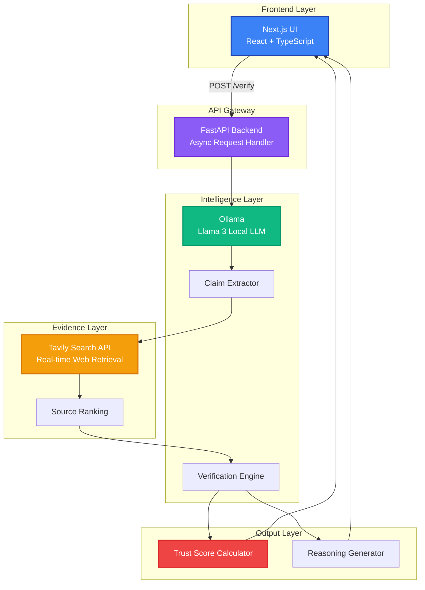

<div align="center">

# 🧠 AI Veritas

### *Explainable Trust Scoring for AI-Generated Content*

**Analyze · Verify · Trust with Local-AI Powered Evidence Retrieval**

[](https://nextjs.org/) 
[](https://fastapi.tiangolo.com/)
[](https://ollama.ai/)
[](https://tailwindcss.com/)
[](https://www.python.org/)

[🚀 Live Demo](https://gfgbq-team-overclocked.vercel.app/) •[🌟PPT persentation](https://docs.google.com/presentation/d/1HhUosLb7zpg5Y-ZB33XvznepoiydWUWG/edit?usp=sharing&ouid=100974703755561207513&rtpof=true&sd=true)  • [✅Demo Presentation](https://drive.google.com/file/d/1j7jtOyLvY7C9wEkzQaKhHSf11iVtmElN/view?usp=drive_link)• [🤝 Contributing](#-contributing) • [📧 Contact](#-contact)

---


</div>

---

## 📋 Table of Contents

- [Overview](#-overview)
- [The Problem](#-the-problem--the-solution)
- [Key Features](#-key-features)
- [Getting Started](#-getting-started)
- [API Reference](#-api-reference)
- [Use Cases](#-use-cases)
- [Team](#-team)
- [Contributing](#-contributing)
- [License](#-license)

---

## 🌟 Overview

**AI Veritas** is an advanced hallucination detection system that provides transparent, explainable trust scoring for AI-generated content. By combining local LLM reasoning with real-time web evidence retrieval, it offers claim-level verification that helps users understand not just *what* is true, but *why*.

### 🎯 Submission Details

| Field | Details |
|:------|:--------|
| **Problem Statement** | Automated detection and verification of AI hallucinations |
| **Project Name** | AI Veritas |
| **Team Name** | OverClocked |
| **Live Demo** | [https://gfgbq-team-overclocked-mh2s.vercel.app/](https://gfgbq-team-overclocked-mh2s.vercel.app/) |
| **Source Code** | [https://github.com/ByteQuest-2025/GFGBQ-Team-overclocked.git](https://github.com/ByteQuest-2025/GFGBQ-Team-overclocked.git) |
| **Video Presentation** | https://drive.google.com/file/d/1j7jtOyLvY7C9wEkzQaKhHSf11iVtmElN/view?usp=drive_link |
| PPT  | https://docs.google.com/presentation/d/1HhUosLb7zpg5Y-ZB33XvznepoiydWUWG/edit?usp=sharing&ouid=100974703755561207513&rtpof=true&sd=true
---

## 🌟 Screenshots


---

## 🚨 The Problem & The Solution

### The Challenge

Modern AI systems frequently produce **confident but factually incorrect statements**, known as **hallucinations**. This creates:

- ❌ **Trust Deficit**: No transparent, automated way to verify AI-generated text
- ❌ **Lack of Explainability**: Users can't identify *which* specific claims are incorrect or *why*
- ❌ **Risk Propagation**: Misinformation spreads when AI outputs are blindly trusted

### ✅ The Veritas Approach

AI Veritas bridges the trust gap through:

1. **🔬 Atomic Extraction**: Decomposes paragraphs into single, independently verifiable facts
2. **🔄 Hybrid Verification**: Combines **Local LLM reasoning** (Llama 3) with **Live Web Evidence** (Tavily API)
3. **📊 Transparent Scoring**: Delivers claim-level verdicts with an overall **Trust Score (0-100)**
4. **💡 Explainability**: Provides detailed reasoning and source citations for every verdict

---

## ✨ Key Features

<table>
<tr>
<td width="50%">

### 🔍 Intelligent Claim Extraction

Break down complex AI-generated text into atomic, verifiable claims for precise analysis.

</td>
<td width="50%">

### 📊 Trust Score Dashboard

Get an at-a-glance reliability metric (0-100) with detailed breakdowns.

</td>
</tr>
<tr>
<td width="50%">

### 🚦 Tri-State Verification

**🟢 Verified** - Evidence confirms the claim  
**🟡 Inconclusive** - Conflicting or missing evidence  
**🔴 Contradicted** - Evidence disproves the claim

</td>
<td width="50%">

### 💡 Explainable AI

Every verdict includes detailed reasoning and direct source links for full transparency.

</td>
</tr>
<tr>
<td width="50%">

### 🔒 Privacy-First Architecture

Local LLM processing ensures sensitive data never leaves your infrastructure.

</td>
<td width="50%">

### ⚡ Real-Time Processing

Async architecture with FastAPI ensures rapid verification without blocking.

</td>
</tr>
</table>

---

## 🏗️ System Architecture



### Architecture Highlights

- **Distributed Processing**: Local LLM ensures data privacy and low latency
- **Async Design**: Non-blocking I/O for handling multiple verification requests
- **Hybrid Intelligence**: Combines reasoning capabilities with real-world evidence
- **Modular Components**: Easy to extend with additional verification sources

---

## 🛠️ Tech Stack

### Backend Engine

```yaml
Runtime: Python 3.10+
Framework: FastAPI (async/await support)
AI Engine: Ollama (Llama 3 running locally)
Search API: Tavily API (real-time web evidence)
Async I/O: asyncio, httpx
```

### Frontend Interface

```yaml
Framework: Next.js 14 (App Router)
Language: TypeScript
Styling: Tailwind CSS v3
Icons: Lucide React
State: React Hooks (useState, useEffect)
```

### Infrastructure

```yaml
Deployment: Vercel (Frontend), Self-hosted (Backend)
API Protocol: REST (JSON)
Model Hosting: Ollama (LAN-accessible)
```

---

## 🚀 Getting Started

### Prerequisites

- **Python 3.10+** installed
- **Node.js 18+** and npm/yarn
- **Ollama** installed and running
- **Tavily API key** ([Get one here](https://tavily.com/))

### 1️⃣ Backend Setup

```bash
# Clone the repository
git clone https://github.com/ByteQuest-2025/GFGBQ-Team-overclocked.git
cd GFGBQ-Team-overclocked/backend

# Create virtual environment
python -m venv venv

# Activate virtual environment
# On macOS/Linux:
source venv/bin/activate
# On Windows:
venv\Scripts\activate

# Install dependencies
pip install -r requirements.txt
```

**Configure Environment Variables**

Create a `.env` file in the `backend/` directory:

```env
TAVILY_API_KEY=your_tavily_api_key_here
OLLAMA_BASE_URL=http://localhost:11434
# Or use your LAN IP: http://192.168.1.100:11434
```

**Start the Backend Server**

```bash
uvicorn main:app --reload --host 0.0.0.0 --port 8000
```

The API will be available at `http://localhost:8000`

### 2️⃣ Ollama Configuration

Ensure Ollama is serving on your network:

```bash
# Pull the Llama 3 model
ollama pull llama3

# Start Ollama server (accessible on LAN)
OLLAMA_HOST=0.0.0.0 ollama serve
```

**Verify Ollama is running:**

```bash
curl http://localhost:11434/api/tags
```

### 3️⃣ Frontend Setup

```bash
# Navigate to frontend directory
cd ../frontend

# Install dependencies
npm install
# or
yarn install

# Start development server
npm run dev
# or
yarn dev
```

The frontend will be available at `http://localhost:3000`

### 4️⃣ Test the System

Open your browser and navigate to `http://localhost:3000`

**Example Test Input:**

```
The Eiffel Tower was completed in 1889 and stands 324 meters tall. 
It was designed by Gustave Eiffel and is located in Paris, France.
```

---

## 📡 API Reference

### Verification Endpoint

**`POST /verify`**

Verifies AI-generated text and returns claim-level analysis with trust scoring.

#### Request

```bash
curl -X POST http://localhost:8000/verify \
  -H "Content-Type: application/json" \
  -d '{
    "text": "The Eiffel Tower was completed in 1889."
  }'
```

#### Request Body

```json
{
  "text": "string (required) - The AI-generated text to verify"
}
```

#### Response

```json
{
  "overall_trust_score": 98,
  "total_claims": 1,
  "verified_claims": 1,
  "contradicted_claims": 0,
  "inconclusive_claims": 0,
  "claims": [
    {
      "id": "claim_1",
      "original_text": "The Eiffel Tower was completed in 1889.",
      "status": "verified",
      "confidence_score": 95,
      "reasoning": "Historical records from multiple reliable sources confirm that the Eiffel Tower was completed in March 1889 for the 1889 World's Fair in Paris.",
      "sources": [
        {
          "url": "https://en.wikipedia.org/wiki/Eiffel_Tower",
          "title": "Eiffel Tower - Wikipedia",
          "relevance_score": 0.98
        }
      ],
      "evidence_summary": "Construction began in 1887 and was completed on March 31, 1889."
    }
  ],
  "processing_time_ms": 2847
}
```

#### Response Fields

| Field | Type | Description |
|-------|------|-------------|
| `overall_trust_score` | integer | Global trust score (0-100) |
| `total_claims` | integer | Number of atomic claims extracted |
| `verified_claims` | integer | Claims confirmed by evidence |
| `contradicted_claims` | integer | Claims disproven by evidence |
| `inconclusive_claims` | integer | Claims with insufficient evidence |
| `claims` | array | Detailed analysis for each claim |
| `processing_time_ms` | integer | Total processing time in milliseconds |

#### Claim Status Values

- **`verified`** 🟢: Evidence strongly supports the claim
- **`contradicted`** 🔴: Evidence actively disproves the claim
- **`inconclusive`** 🟡: Insufficient or conflicting evidence

---

## 💼 Use Cases

<table>
<tr>
<td width="50%">

### 📰 Journalism & Fact-Checking

Verify AI-generated news summaries and detect potential misinformation before publication.

</td>
<td width="50%">

### 🎓 Academic Research

Validate AI-assisted research summaries and literature reviews for accuracy.

</td>
</tr>
<tr>
<td width="50%">

### 💼 Business Intelligence

Cross-check AI-generated market reports and business insights with real-time data.

</td>
<td width="50%">

### ⚖️ Legal & Compliance

Verify AI-generated legal summaries and ensure regulatory compliance.

</td>
</tr>
<tr>
<td width="50%">

### 🏥 Healthcare Information

Validate medical information generated by AI assistants with trusted sources.

</td>
<td width="50%">

### 📚 Educational Content

Ensure AI-generated educational materials are factually accurate for students.

</td>
</tr>
</table>

---

## 🗺️ Roadmap

### Phase 1: Core Enhancement (Q1 2025)

- [ ] **Multi-language Support**: Verification in 10+ languages
- [ ] **Batch Processing**: Verify multiple documents simultaneously
- [ ] **Enhanced Scoring**: More granular confidence metrics

### Phase 2: Advanced Features (Q2 2025)

- [ ] **Document Analysis**: Upload and verify PDFs, research papers, and ebooks
- [ ] **Live Streaming**: Real-time claim verification with WebSocket support
- [ ] **Browser Extension**: Chrome/Firefox extension for instant verification
- [ ] **API Rate Limiting**: Enterprise-grade throttling and quotas

### Phase 3: Integration & Scale (Q3 2025)

- [ ] **Academic Sources**: Integration with PubMed, arXiv, and IEEE Xplore
- [ ] **Custom Models**: Support for fine-tuned domain-specific LLMs
- [ ] **Collaborative Verification**: Team workspaces and shared annotations
- [ ] **Audit Logs**: Complete verification history and compliance tracking

### Phase 4: Enterprise (Q4 2025)

- [ ] **On-Premise Deployment**: Self-hosted enterprise solution
- [ ] **SSO Integration**: SAML, OAuth, and Active Directory support
- [ ] **Advanced Analytics**: Dashboard with verification trends and insights
- [ ] **White-Label Option**: Customizable branding for partners

---

## 👥 Team

<table>
<tr>
<td align="center" width="25%">
<br />
<strong>Architect</strong><br />
<sub>Backend orchestration<br/>& scoring logic</sub>
</td>
<td align="center" width="25%">
<br />
<strong>Librarian</strong><br />
<sub>Evidence retrieval<br/>& source ranking</sub>
</td>
<td align="center" width="25%">
<br />
<strong>Fact Checker</strong><br />
<sub>Claim-to-evidence<br/>verification</sub>
</td>
<td align="center" width="25%">
<br />
<strong>Visualizer</strong><br />
<sub>UI/UX & dashboard<br/>development</sub>
</td>
</tr>
</table>

---

## 🤝 Contributing

We welcome contributions from the community! Here's how you can help:

### Contribution Guidelines

1. **Fork the repository**
2. **Create a feature branch**: `git checkout -b feature/amazing-feature`
3. **Commit your changes**: `git commit -m 'Add amazing feature'`
4. **Push to the branch**: `git push origin feature/amazing-feature`
5. **Open a Pull Request**

### Development Setup

Please follow the [Getting Started](#-getting-started) guide to set up your development environment.

### Code Style

- **Python**: Follow PEP 8 style guide
- **TypeScript/React**: Follow ESLint and Prettier configurations
- **Commits**: Use conventional commit messages

### Areas for Contribution

- 🐛 Bug fixes and issue resolution
- ✨ New verification sources integration
- 📝 Documentation improvements
- 🎨 UI/UX enhancements
- 🧪 Test coverage expansion

---

## 📄 License

This project is licensed under the **MIT License** - see the [LICENSE](LICENSE) file for details.

---

## 📧 Contact

**Team OverClocked**

- 📧 **Email**: 
  - abhinaycoding@gmail.com
  - abhishekangadismailbox@gmail.com
  - unknownmember4u@gmail.com
  - rishikapandharpurkar01@gmail.com

- 🐛 **Issues**: [GitHub Issues](https://github.com/ByteQuest-2025/GFGBQ-Team-overclocked/issues)
- 💬 **Discussions**: [GitHub Discussions](https://github.com/ByteQuest-2025/GFGBQ-Team-overclocked/discussions)

---

<div align="center">

### ⭐ Star us on GitHub — it motivates us a lot!

**Team OverClocked**

[🚀 Live Demo](https://gfgbq-team-overclocked-mh2s.vercel.app/) • [📖 Documentation](#-getting-started) • [🤝 Contribute](#-contributing)

---

**AI Veritas** - *Because Truth Matters*

</div>
